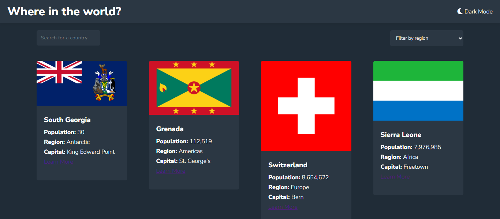

# Frontend Mentor - REST Countries API with Color Theme Switcher Solution

This is a solution to the [REST Countries API with color theme switcher challenge on Frontend Mentor](https://www.frontendmentor.io/challenges/rest-countries-api-with-color-theme-switcher-5cacc469fec04111f7b848ca). This challenge helps improve coding skills by building realistic projects.

## Table of Contents

- [Overview](#overview)
  - [The Challenge](#the-challenge)
  - [Screenshot](#screenshot)
  - [Links](#links)
- [My Process](#my-process)
  - [Built With](#built-with)
  - [What I Learned](#what-i-learned)
  - [Continued Development](#continued-development)
  - [Useful Resources](#useful-resources)
- [Author](#author)
- [Acknowledgments](#acknowledgments)

## Overview

### The Challenge

Users should be able to:

- See all countries from the API on the homepage
- Search for a country using an `input` field
- Filter countries by region
- Click on a country to see more detailed information on a separate page
- Click through to the border countries on the detail page
- Toggle the color scheme between light and dark mode

### Screenshot



_Add a screenshot of your project here._

### Links

- [Solution URL](#) _(https://github.com/Tianaah/rest-countries-api)_
- [Live Site URL](#) \_(http://127.0.0.1:5501/)

## My Process

### Built With

- Semantic HTML5 markup
- CSS custom properties
- Flexbox
- CSS Grid
- Mobile-first workflow
- [React](https://reactjs.org/) - JavaScript library
- [React Router](https://reactrouter.com/) - For routing
- [Styled Components](https://styled-components.com/) - For styles

### What I Learned

This project helped me gain a deeper understanding of API fetching, state management in React, and implementing dynamic search and filter functionalities.

#### Example Code:

```js
const fetchCountryData = async () => {
  try {
    const response = await fetch("https://restcountries.com/v3.1/all");
    const data = await response.json();
    setCountries(data);
  } catch (error) {
    console.error("Error fetching countries:", error);
  }
};
```

### Continued Development

In future projects, I want to:

- Improve state management by implementing **Redux** or **React Context API**.
- Enhance the UI by adding animations.
- Implement lazy loading for better performance.

### Useful Resources

- [MDN Web Docs](https://developer.mozilla.org/) - Documentation for web technologies.
- [React Docs](https://react.dev/) - Official React documentation.
- [Frontend Mentor Community](https://www.frontendmentor.io/) - Helpful insights from other developers.

## Author

- Frontend Mentor - [@Tianaah](https://www.frontendmentor.io/profile/Tianaah)
- GitHub - [@Tianaah](https://github.com/Tianaah)

## Acknowledgments

Special thanks to the Frontend Mentor community for feedback and guidance. Shoutout to developers who shared their insights on best practices for React and API handling.
